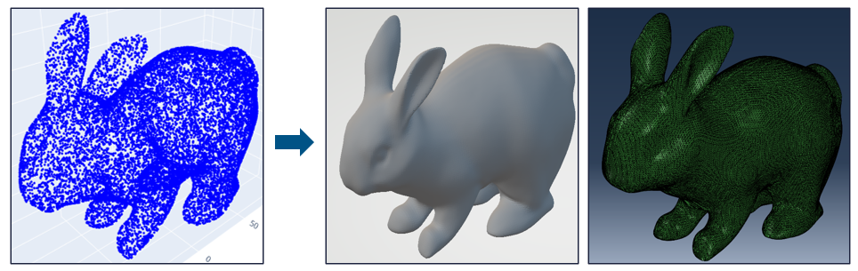
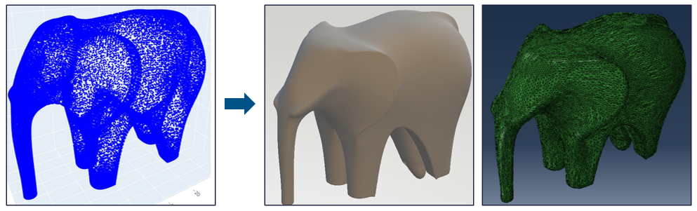
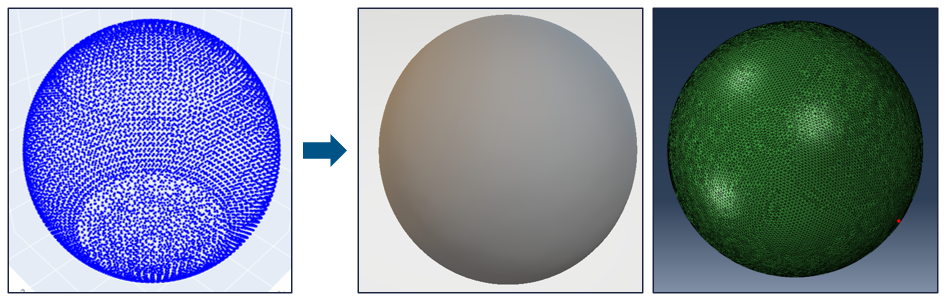
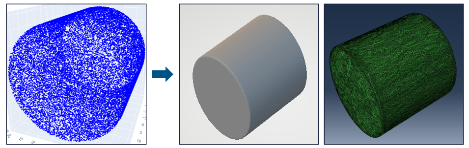
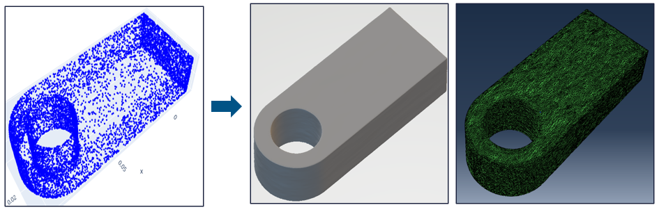
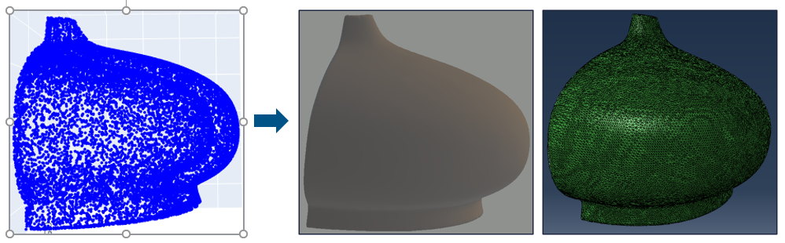
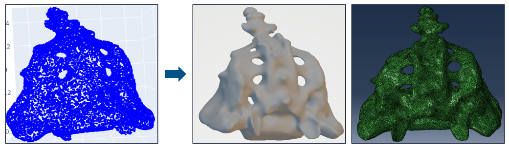
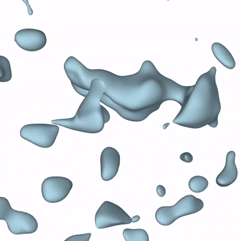
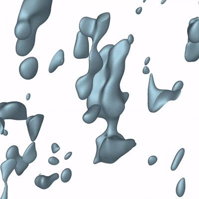
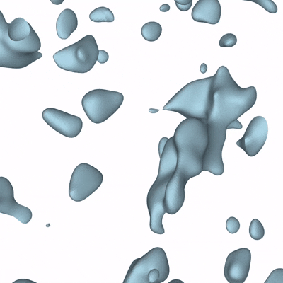

# Self-supervised Neural Signed Distance Function Model For Surface Reconstruction

This repository contains the full project files, report, poster, and demonstration animations for a self-supervised neural framework that reconstructs 3D surfaces directly from unstructured point clouds using Signed Distance Functions (SDFs).

---

## 🚀 Project Overview

Reconstructing accurate 3D surfaces from sparse, noisy point cloud data remains a significant challenge, especially without supervision or mesh connectivity.  
This project implements a self-supervised Signed Distance Function (SDF) learning pipeline using Sinusoidal Representation Networks (SIREN), which:

- Learns continuous SDF from point clouds without ground-truth supervision.
- Incorporates multiple geometric losses (Eikonal, Dirichlet, Non-Matching, Neumann, Hessian).
- Uses marching cubes for watertight mesh reconstruction.
- Demonstrates high reconstruction accuracy across CAD-like and complex biological geometries.

---

## 🧠 Model Architecture

- **Network:** 6-layer MLP (4 hidden layers × 256 neurons)
- **Activation:** Sinusoidal activation (ω₀ = 30)
- **Optimizer:** Adam (`lr=1e-5`)
- **Training:** 10,000 epochs
- **Loss Functions:**  
    - Eikonal Loss  
    - Dirichlet Matching Loss  
    - Dirichlet Non-Matching Loss  
    - Alignment Loss  
    - Neumann Loss  
    - Singular Hessian Loss

---

## 🔧 Pipeline Workflow

1. Load Point Cloud (STL/OBJ models)
2. Data Preparation (Surface points P, near-surface Ω, far-field Q)
3. Neural SDF Learning with SIREN
4. Custom Loss Functions applied
5. Model Training
6. Surface Reconstruction (Marching Cubes)
7. Evaluation (Chamfer Distance, F-Score, Normal Consistency)

---

## Results

||
||
||
||
||
||
||
||
||

---
## 🎯 Evaluation Results

| Model            | Chamfer Distance | F-Score | Normal Consistency |
|------------------|------------------|---------|---------------------|
| Bunny1          | 3.23             | 0.989   | 0.992               |
| Bunny2          | 4.85             | 0.932   | 0.987               |
| Sphere          | 1.22             | 0.991   | 0.992               |
| Cylinder        | 2.03             | 0.987   | 0.988               |
| Explicit Lug    | 4.89             | 0.940   | 0.992               |
| Elephant        | 3.77             | 0.934   | 0.971               |
| Petal           | 4.99             | 0.985   | 0.991               |
| Sacrum Bone     | 4.45             | 0.912   | 0.979               |
| Cervical Vertebrae | 4.18         | 0.936   | 0.992               |

---

## 🎞 Project Animations

| | | |
|-|-|-|
|  |  |  |

---

## 📄 Files Included

- `report.pdf` – Full technical report
- `poster.pdf` – Poster Presentation
- `assets/animations/` – Model demonstration animations

---

## 📚 References

- Dong et al., Neurcross, ACM TOG, 2024.
- Park et al., DeepSDF, CVPR, 2019.
- Sitzmann et al., SIREN, GitHub, 2020. [GitHub Link](https://github.com/vsitzmann/siren)
- Li et al., Neural Singular Hessian, GitHub, 2024. [GitHub Link](https://github.com/bearprin/Neural-Singular-Hessian)
- Lorensen and Cline, Marching Cubes, ACM SIGGRAPH, 1987.

---

## 👨‍💻 Author

Shubham Godase (MT2308)  
Savitribai Phule Pune University (SPPU), SCMS

---

